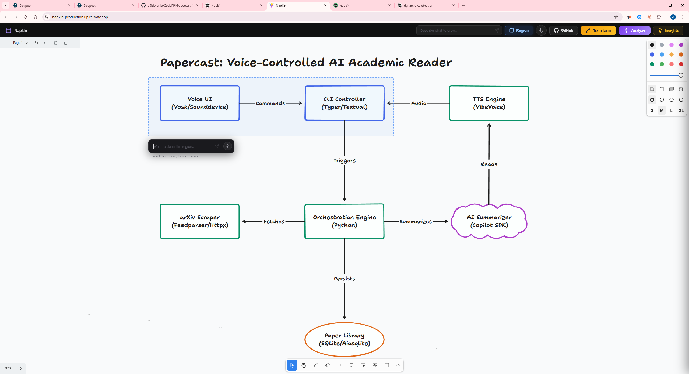
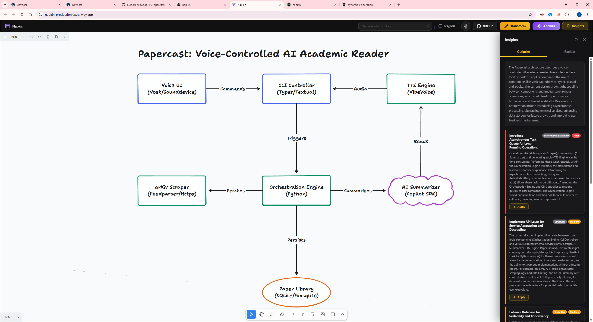
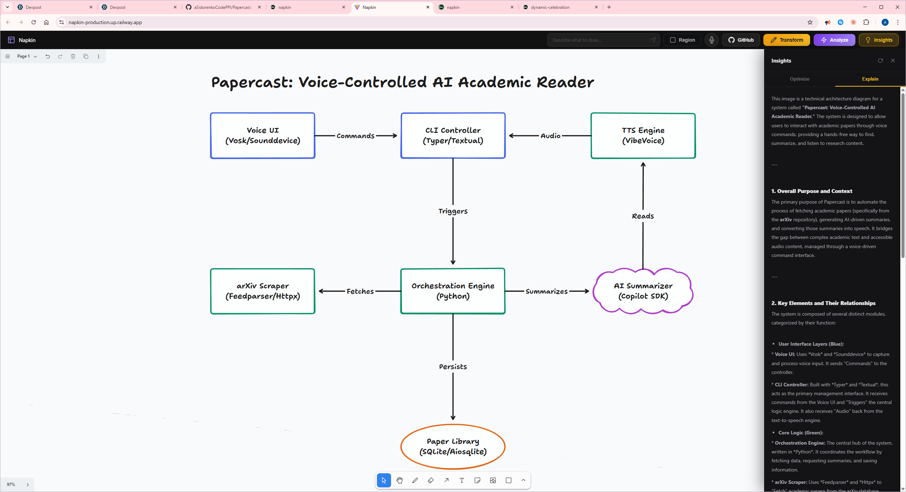
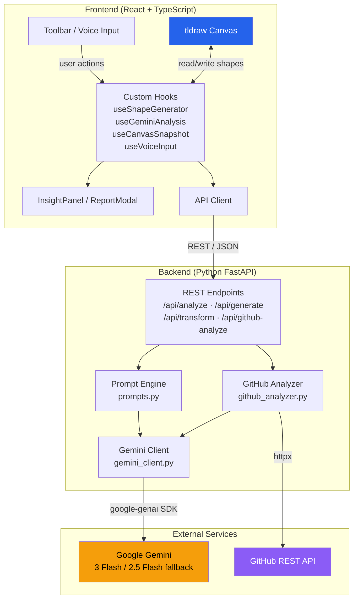

# Napkin

**Sketch it. Say it. Ship it.**

Napkin is an AI-powered collaborative canvas that turns rough sketches, voice commands, and text prompts into polished diagrams in seconds. Powered by Google Gemini, it bridges the gap between quick ideation and presentable visuals.

---

## What it does

- **Draw freely** on an infinite canvas powered by [tldraw](https://tldraw.com)
- **Generate diagrams from text** -- describe what you want and watch it appear
- **Transform sketches** -- draw rough shapes and let AI clean them into structured diagrams
- **Analyze anything** -- get auto-labels, Mermaid diagrams, improvement suggestions, and detailed explanations in one click
- **Insights panel** -- slide-in side panel with Optimize (actionable recommendations you can apply to the canvas with one click) and Explain (architecture summary) tabs
- **Voice input** -- speak your diagram into existence using the built-in speech-to-text
- **GitHub import** -- paste a repo URL and get an architecture diagram generated from its structure

## Screenshots

### Generate a diagram from a text prompt


### Analyze your sketch with parallel AI analysis


### Get a full analysis report with structured diagrams and Mermaid code


### Insights Panel — Optimize


### Insights Panel — Explain


### Import a GitHub repo as an architecture diagram


## Tech Stack

| Layer    | Tech                                         |
| -------- | -------------------------------------------- |
| Frontend | React 19, TypeScript, Vite, tldraw, Mermaid  |
| Backend  | Python, FastAPI, uvicorn                      |
| AI       | Google Gemini 3 Flash Preview (fallback: 2.5 Flash) |
| APIs     | GitHub REST API (for repo analysis)           |

## Getting Started

### Prerequisites

- Node.js 18+
- Python 3.10+
- A [Google Gemini API key](https://aistudio.google.com/apikey)

### 1. Clone the repo

```bash
git clone https://github.com/aSidorenkoCodePPI/napkin.git
cd napkin
```

### 2. Backend setup

```bash
cd backend
python -m venv .venv

# Windows
.venv\Scripts\activate
# macOS/Linux
source .venv/bin/activate

pip install -r requirements.txt
```

Create a `.env` file in `backend/`:

```
GEMINI_API_KEY=your_api_key_here
```

Start the backend:

```bash
uvicorn main:app --reload
```

### 3. Frontend setup

```bash
cd frontend
npm install
npm run dev
```

Open [http://localhost:5173](http://localhost:5173) and start drawing.

## Architecture



### Data Flow

1. The user draws on the canvas, types a prompt, or speaks a command
2. The frontend captures a canvas snapshot (base64 PNG) or text input
3. The API client sends the payload to the FastAPI backend
4. The backend selects the right prompt template and calls Gemini
5. Gemini returns structured JSON (shapes, labels, Mermaid code, or recommendations)
6. The frontend parses the response and renders shapes directly onto the tldraw canvas

## Features in Detail

### Analyze Mode

Runs 5 AI analyses in parallel on your canvas content:

| Analysis | Output                                       |
| -------- | -------------------------------------------- |
| Label    | Identifies and names every element            |
| Cleanup  | Converts to a clean Mermaid.js diagram        |
| Suggest  | Prioritized improvement suggestions           |
| Explain  | Detailed markdown explanation of the content  |
| Optimize | Actionable architecture optimization advice   |

Results are presented in a downloadable PDF report.


### Insights Panel

A lightweight side panel that slides in from the right with two tabs:

- **Optimize** -- Analyzes your architecture diagram and generates prioritized recommendations across performance, security, structure, and scalability. Each recommendation has an **Apply** button that directly modifies the canvas (adds, edits, or removes shapes) to implement the suggestion.
- **Explain** -- Provides a concise architecture summary rendered as markdown.

Each tab lazily fetches results on first click and caches them until the panel is closed.


### Generate Mode

Type or speak a description and Napkin creates shapes directly on the canvas. Supports:

- Architecture diagrams
- Flowcharts
- Mind maps
- Entity-relationship diagrams
- Any freeform diagram


### Transform Mode

Draw rough shapes by hand, hit Transform, and Napkin converts your sketches into clean, properly labeled digital shapes while preserving your layout.

### GitHub Import

Paste any public GitHub repo URL. Napkin fetches the repo structure, analyzes it with Gemini, and generates a color-coded architecture diagram with:

- Blue for frontend/client
- Green for backend/API
- Orange for databases
- Violet for external services


## Project Structure

```
napkin/
├── Dockerfile              # Multi-stage build (Node + Python)
├── README.md
│
├── frontend/               # React 19 + TypeScript + Vite
│   ├── src/
│   │   ├── App.tsx         # Root component & state management
│   │   ├── api/            # REST client (client.ts)
│   │   ├── components/     # 10 React components
│   │   │   ├── WhiteboardCanvas.tsx   # tldraw editor
│   │   │   ├── InsightPanel.tsx       # Optimize / Explain panel
│   │   │   ├── ReportModal.tsx        # 5-tab analysis + PDF export
│   │   │   ├── RegionSelect.tsx       # Bounded generation overlay
│   │   │   └── ...
│   │   ├── hooks/          # 4 custom hooks
│   │   │   ├── useShapeGenerator.ts   # JSON → tldraw shapes
│   │   │   ├── useGeminiAnalysis.ts   # Parallel 5-mode analysis
│   │   │   ├── useCanvasSnapshot.ts   # Canvas → base64 PNG
│   │   │   └── useVoiceInput.ts       # Web Speech API
│   │   └── types/          # Shared TypeScript definitions
│   └── package.json
│
├── backend/                # Python FastAPI
│   ├── main.py             # API endpoints & SPA routing
│   ├── gemini_client.py    # Gemini SDK wrapper (primary + fallback model)
│   ├── github_analyzer.py  # GitHub repo context fetcher
│   ├── prompts.py          # All AI prompt templates
│   └── requirements.txt
```

## Contributing

1. Fork the repo
2. Create your feature branch (`git checkout -b feature/cool-thing`)
3. Commit your changes (`git commit -m 'Add cool thing'`)
4. Push to the branch (`git push origin feature/cool-thing`)
5. Open a Pull Request

## License

MIT

---

Built with Gemini at the Gemini 3 Hackathon.
